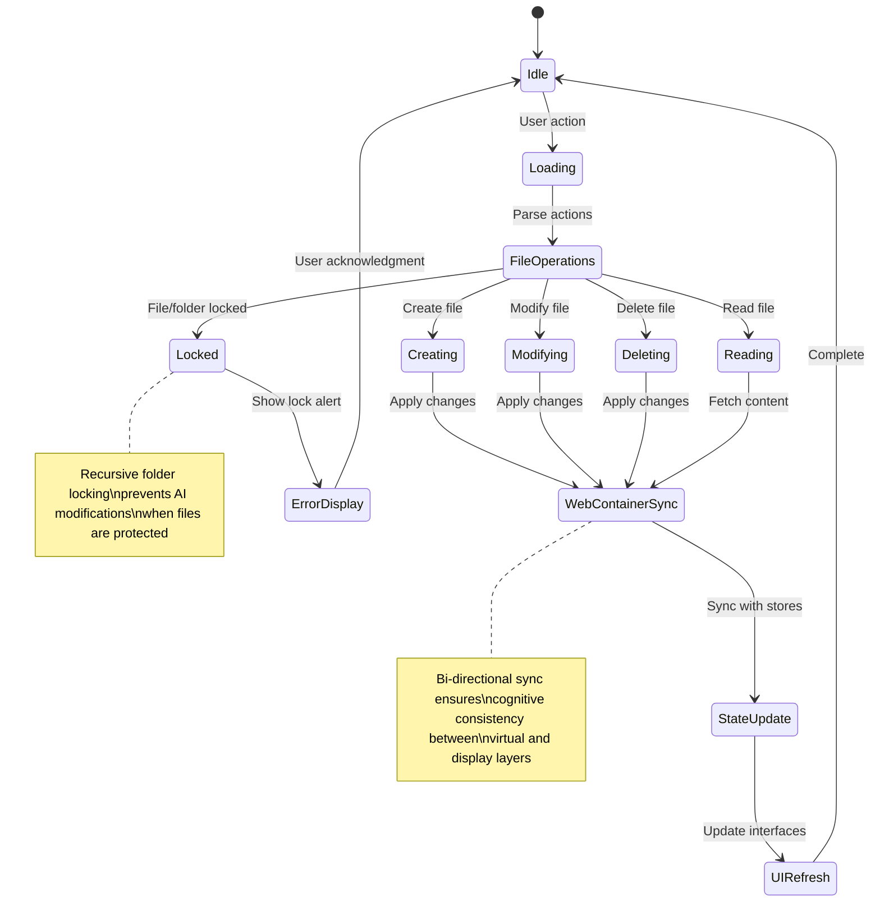

# Bolt.diy Architecture Documentation

## Overview

Bolt.diy is a sophisticated AI-powered full-stack web development platform that enables cognitive collaboration between humans and large language models. The system demonstrates emergent cognitive patterns through neural-symbolic integration, creating a recursive implementation pathway for adaptive code generation and development workflows.

## High-Level System Architecture

## Cognitive Flowchart: Neural-Symbolic Integration

## Component Interaction Diagram

## Data Flow: AI Processing Pipeline

## LLM Provider Architecture

## File System and State Management

## Workbench Cognitive Architecture

## Emergent Cognitive Patterns

### Adaptive Attention Allocation

The system demonstrates emergent cognitive behaviors through several key mechanisms:

1. **Context Selection**: Dynamic context selection based on file relevance and conversation history
2. **Progressive Refinement**: Iterative improvement through feedback loops
3. **Error Correction**: Automatic detection and correction of errors in terminal and preview
4. **Knowledge Synthesis**: Integration of multiple information sources for coherent responses

### Neural-Symbolic Integration Points

## Recursive Implementation Pathways

### Self-Improving Code Generation

1. **Initial Generation**: AI generates code based on user requirements
2. **Execution Feedback**: System captures runtime errors and performance metrics
3. **Error Analysis**: Cognitive analysis of failure patterns
4. **Iterative Refinement**: Automated improvement suggestions
5. **Learning Integration**: Pattern recognition for future implementations

### Hypergraph Relationship Mapping

The system maintains a hypergraph of relationships between:
- **Files and Dependencies**: Understanding project structure
- **User Patterns**: Learning from interaction history
- **Error Contexts**: Building error resolution knowledge
- **Performance Metrics**: Optimizing response quality

## Future Cognitive Enhancements

### Planned Evolutionary Pathways

1. **Enhanced Memory Systems**: Long-term project memory across sessions
2. **Multi-Agent Coordination**: Specialized agents for different development tasks
3. **Predictive Code Completion**: Anticipatory code generation
4. **Automated Testing Integration**: Self-validating code generation
5. **Knowledge Graph Expansion**: Broader context understanding

---

*This documentation represents the current state of bolt.diy's cognitive architecture. The system continues to evolve through emergent patterns and adaptive learning mechanisms.*