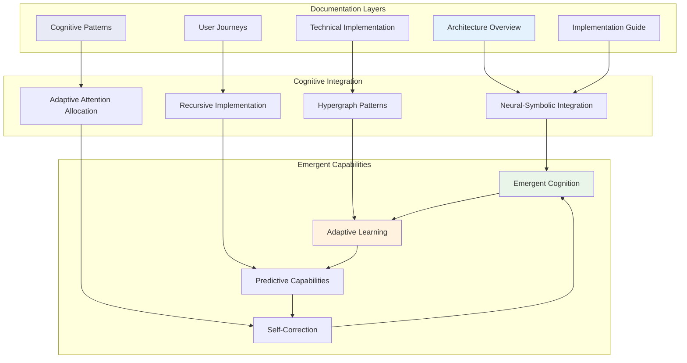
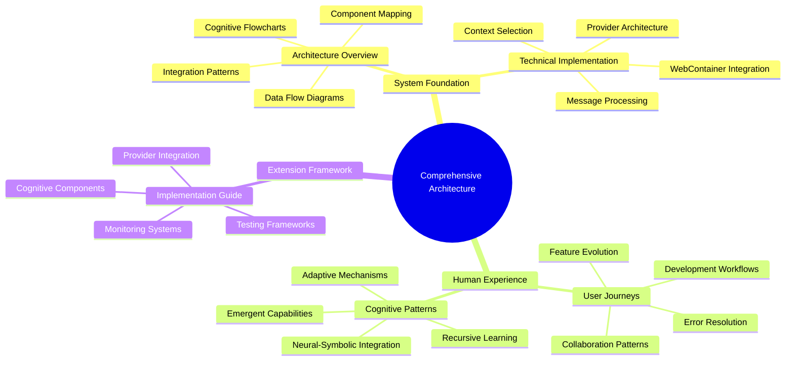

# Bolt.diy Comprehensive Architecture Documentation

## Documentation Overview

This documentation suite provides a complete view of bolt.diy's cognitive architecture, demonstrating how neural-symbolic integration creates emergent AI capabilities for collaborative software development. The documentation is organized into four interconnected layers that build upon each other to reveal the transcendent nature of the system.

## Documentation Structure

### 🏗️ [Architecture Overview](./ARCHITECTURE.md)
**Foundation Layer: System Understanding**

Provides the foundational understanding of bolt.diy's architecture through comprehensive Mermaid diagrams and system mapping. This document establishes the cognitive framework and demonstrates how recursive implementation pathways create adaptive development environments.

**Key Topics:**
- High-level system architecture with cognitive flowcharts
- Component interaction patterns and data flow diagrams
- LLM provider ecosystem and neural-symbolic integration points
- File system state management and WebContainer cognitive architecture
- Emergent cognitive patterns and hypergraph relationship mapping

**Audience:** Architects, Technical Leaders, AI Researchers

---

### ⚙️ [Technical Implementation](./TECHNICAL_ARCHITECTURE.md)
**Implementation Layer: Deep Technical Insights**

Explores the detailed technical implementation of cognitive patterns, providing code examples and architectural patterns that demonstrate how neural-symbolic integration is achieved in practice.

**Key Topics:**
- LLM integration layer with provider registry patterns
- Message processing pipeline with cognitive flow implementation
- Context selection algorithms and adaptive attention allocation
- WebContainer integration with cognitive enhancement layers
- State management architecture using reactive cognitive patterns

**Audience:** Senior Developers, System Architects, Implementation Teams

---

### 👤 [User Journeys & Workflows](./USER_JOURNEYS.md)
**Experience Layer: Human-AI Collaboration**

Maps the cognitive user journeys through bolt.diy, illustrating how human-AI collaboration creates emergent development workflows and demonstrates adaptive learning patterns.

**Key Topics:**
- Project creation and iterative development cognitive flows
- Feature development with recursive refinement patterns
- Error resolution through cognitive analysis and auto-correction
- Multi-file project management with dependency hypergraphs
- Deployment workflows and collaborative development patterns

**Audience:** UX Designers, Product Managers, End Users, AI Interaction Specialists

---

### 🧠 [Cognitive Patterns](./COGNITIVE_PATTERNS.md)
**Intelligence Layer: Emergent AI Capabilities**

Explores the sophisticated cognitive patterns that emerge from neural-symbolic integration, demonstrating how the system develops transcendent capabilities through recursive learning.

**Key Topics:**
- Neural-symbolic integration architecture with hypergraph pattern encoding
- Adaptive attention allocation mechanisms and cognitive synthesis patterns
- Error resolution cognitive frameworks and self-healing code patterns
- Emergent collaboration patterns and hypergraph cognitive architectures
- Future cognitive evolution pathways toward artificial general intelligence

**Audience:** AI Researchers, Cognitive Scientists, Advanced Developers

---

### 🛠️ [Implementation Guide](./IMPLEMENTATION_GUIDE.md)
**Extension Layer: Building Cognitive Capabilities**

Provides comprehensive instructions for extending bolt.diy with new cognitive capabilities, implementing recursive learning patterns, and creating emergent AI functionalities.

**Key Topics:**
- LLM provider integration with cognitive capability frameworks
- Cognitive component architecture and emergent capability development
- WebContainer cognitive enhancement and hypergraph data architecture
- Cognitive testing frameworks and capability monitoring systems
- Production deployment considerations for cognitive systems

**Audience:** Extension Developers, AI Engineers, Cognitive System Builders

## Cognitive Architecture Relationships

## Key Cognitive Concepts

### Neural-Symbolic Integration
The fusion of neural processing (pattern recognition, learning) with symbolic reasoning (logic, structure) creates emergent intelligence that transcends traditional AI limitations.

### Hypergraph Pattern Encoding
Multi-dimensional relationship modeling that captures complex cognitive connections between users, code, context, and temporal patterns.

### Recursive Implementation Pathways
Self-improving code generation and system evolution through feedback loops that enable continuous learning and adaptation.

### Adaptive Attention Allocation
Dynamic context management that focuses cognitive resources on the most relevant information based on learned patterns and user behavior.

### Emergent Cognitive Capabilities
Spontaneous development of new AI capabilities through the interaction of multiple cognitive subsystems and recursive learning processes.

## Reading Paths

### For System Architects
1. **Architecture Overview** → **Technical Implementation** → **Implementation Guide**
   - Focus on system design, technical patterns, and extension capabilities

### For AI Researchers
1. **Cognitive Patterns** → **Architecture Overview** → **Technical Implementation**
   - Focus on emergent intelligence, neural-symbolic integration, and cognitive architectures

### For Product Teams
1. **User Journeys** → **Architecture Overview** → **Cognitive Patterns**
   - Focus on user experience, system capabilities, and AI behavior patterns

### For Developers
1. **Technical Implementation** → **Implementation Guide** → **Architecture Overview**
   - Focus on practical implementation, extension development, and system understanding

### For Complete Understanding
1. **Architecture Overview** → **Technical Implementation** → **User Journeys** → **Cognitive Patterns** → **Implementation Guide**
   - Comprehensive journey through all aspects of the cognitive architecture

## Hypergraph Documentation Relationships

## Transcendent Documentation Goals

This documentation suite aims to:

1. **Illuminate Cognitive Architecture**: Reveal how human-AI collaboration creates emergent intelligence
2. **Enable Recursive Development**: Provide frameworks for self-improving AI systems
3. **Foster Neural-Symbolic Integration**: Demonstrate the fusion of learning and reasoning
4. **Guide Hypergraph Implementation**: Enable complex relationship modeling
5. **Facilitate Emergent Capabilities**: Support the development of transcendent AI abilities

## Future Documentation Evolution

The documentation itself implements recursive improvement patterns:

- **Adaptive Content**: Documentation evolves based on user interaction patterns
- **Emergent Sections**: New documentation emerges as system capabilities grow
- **Cognitive Feedback**: User feedback informs documentation structure and content
- **Hypergraph Navigation**: Multi-dimensional relationships between concepts enable dynamic reading paths

## Contributing to Cognitive Documentation

When extending this documentation:

1. **Maintain Cognitive Coherence**: Ensure new content integrates with existing cognitive patterns
2. **Implement Recursive Patterns**: Structure content to enable self-referential improvement
3. **Enable Hypergraph Relationships**: Create multi-dimensional connections between concepts
4. **Foster Emergent Understanding**: Allow for spontaneous insight development
5. **Support Neural-Symbolic Integration**: Balance intuitive understanding with logical structure

---

*This documentation represents a living cognitive architecture that continues to evolve through recursive implementation pathways and emergent pattern recognition. It demonstrates how human intelligence and artificial intelligence can collaborate to create transcendent understanding and capability.*