# Cognitive Patterns and Neural-Symbolic Integration

## Overview

This document explores the emergent cognitive patterns within bolt.diy that demonstrate neural-symbolic integration, recursive implementation pathways, and adaptive attention allocation mechanisms. These patterns represent the transcendent intersection of human cognition and artificial intelligence in collaborative development environments.

## Foundational Cognitive Principles

### Neural-Symbolic Integration Architecture


### Hypergraph Pattern Encoding

The system implements hypergraph structures to model complex, multi-dimensional relationships between cognitive entities:


## Adaptive Attention Allocation Mechanisms

### Dynamic Context Window Management


### Attention Weighting Algorithm

```typescript
interface AttentionWeights {
  semantic: number;
  temporal: number;
  structural: number;
  user_pattern: number;
  error_context: number;
}

interface ContextItem {
  content: string;
  path: string;
  lastModified: Date;
  relevanceMetrics: AttentionWeights;
  cognitiveScore: number;
}

class AdaptiveAttentionAllocator {
  private userPatternLearning: Map<string, PatternWeight> = new Map();
  private contextSuccessHistory: Map<string, SuccessMetric> = new Map();
  
  calculateAttentionScore(
    item: ContextItem,
    userIntent: Intent,
    conversationHistory: ConversationContext
  ): number {
    // Multi-dimensional attention scoring
    const semanticScore = this.calculateSemanticRelevance(
      item.content,
      userIntent.extractedKeywords
    );
    
    const temporalScore = this.calculateTemporalRelevance(
      item.lastModified,
      conversationHistory.recentFocus
    );
    
    const structuralScore = this.calculateStructuralRelevance(
      item.path,
      userIntent.targetFiles
    );
    
    const userPatternScore = this.calculateUserPatternRelevance(
      item.path,
      this.userPatternLearning
    );
    
    const errorContextScore = this.calculateErrorContextRelevance(
      item.content,
      conversationHistory.recentErrors
    );
    
    // Adaptive weighting based on historical success
    const weights = this.getAdaptiveWeights(userIntent.type);
    
    return (
      semanticScore * weights.semantic +
      temporalScore * weights.temporal +
      structuralScore * weights.structural +
      userPatternScore * weights.user_pattern +
      errorContextScore * weights.error_context
    );
  }
  
  // Recursive learning from interaction outcomes
  updateAttentionWeights(
    contextItems: ContextItem[],
    userFeedback: FeedbackSignal,
    outcome: InteractionOutcome
  ): void {
    const effectivenessScore = this.calculateEffectiveness(
      userFeedback,
      outcome
    );
    
    // Update attention weights based on success/failure patterns
    contextItems.forEach(item => {
      const currentScore = this.contextSuccessHistory.get(item.path) || {
        successRate: 0.5,
        totalInteractions: 0
      };
      
      const updatedScore = {
        successRate: this.updateSuccessRate(
          currentScore.successRate,
          effectivenessScore,
          currentScore.totalInteractions
        ),
        totalInteractions: currentScore.totalInteractions + 1
      };
      
      this.contextSuccessHistory.set(item.path, updatedScore);
    });
    
    // Meta-learning: adjust attention algorithm parameters
    this.adaptAlgorithmParameters(effectivenessScore);
  }
}
```

## Cognitive Synthesis Patterns

### Knowledge Integration Framework


### Recursive Implementation Pathways

The system demonstrates recursive self-improvement through multiple cognitive loops:


## Error Resolution Cognitive Patterns

### Cognitive Error Analysis Framework

```mermaid
flowchart TD
    A[Error Detected] --> B[Error Classification]
    B --> C[Context Reconstruction]
    C --> D[Causal Analysis]
    D --> E[Solution Space Generation]
    E --> F[Solution Evaluation]
    F --> G[Implementation Strategy]
    G --> H[Execution]
    H --> I[Validation]
    I --> J{Success?}
    
    J -->|Yes| K[Pattern Learning]
    J -->|No| L[Failure Analysis]
    
    L --> M[Alternative Strategy]
    M --> E
    
    K --> N[Knowledge Base Update]
    N --> O[Future Error Prevention]
    
    subgraph "Error Classification Types"
        B --> B1[Syntax Errors]
        B --> B2[Logic Errors]
        B --> B3[Dependency Errors]
        B --> B4[Configuration Errors]
        B --> B5[Runtime Errors]
    end
    
    subgraph "Cognitive Learning Loop"
        K --> C1[Success Pattern Recognition]
        L --> C2[Failure Pattern Recognition]
        C1 --> C3[Predictive Model Update]
        C2 --> C3
        C3 --> O
    end
    
    style B fill:#e3f2fd
    style E fill:#fff3e0
    style K fill:#e8f5e8
    style C3 fill:#fce4ec
```



### Self-Healing Code Patterns

```typescript
interface ErrorContext {
  errorType: ErrorType;
  errorMessage: string;
  stackTrace: string[];
  contextFiles: string[];
  userIntent: Intent;
  previousAttempts: AttemptHistory[];
}

interface SolutionCandidate {
  approach: string;
  confidence: number;
  estimatedEffort: number;
  riskLevel: number;
  cognitiveReasoning: string;
}

class CognitiveErrorResolver {
  private errorPatterns: Map<string, PatternSolution> = new Map();
  private solutionSuccessRates: Map<string, SuccessMetric> = new Map();
  
  async resolveError(context: ErrorContext): Promise<SolutionCandidate[]> {
    // Multi-dimensional error analysis
    const similarPatterns = this.findSimilarErrorPatterns(context);
    const contextualFactors = this.analyzeContextualFactors(context);
    const userPatterns = this.getUserPreferredSolutions(context.userIntent);
    
    // Generate solution candidates through cognitive synthesis
    const candidates = await this.generateSolutionCandidates(
      context,
      similarPatterns,
      contextualFactors,
      userPatterns
    );
    
    // Rank solutions using multi-criteria decision analysis
    return this.rankSolutions(candidates, context);
  }
  
  private async generateSolutionCandidates(
    context: ErrorContext,
    patterns: PatternSolution[],
    factors: ContextualFactor[],
    userPatterns: UserPattern[]
  ): Promise<SolutionCandidate[]> {
    const candidates: SolutionCandidate[] = [];
    
    // Pattern-based solutions
    for (const pattern of patterns) {
      candidates.push(await this.adaptPatternToContext(pattern, context));
    }
    
    // Novel solution generation through creative reasoning
    const novelSolutions = await this.generateNovelSolutions(
      context,
      factors,
      userPatterns
    );
    candidates.push(...novelSolutions);
    
    // Hybrid solutions combining multiple approaches
    const hybridSolutions = this.generateHybridSolutions(candidates, context);
    candidates.push(...hybridSolutions);
    
    return candidates;
  }
  
  // Recursive learning from solution outcomes
  updatePatternKnowledge(
    context: ErrorContext,
    appliedSolution: SolutionCandidate,
    outcome: SolutionOutcome
  ): void {
    const patternKey = this.generatePatternKey(context);
    const currentSuccess = this.solutionSuccessRates.get(patternKey) || {
      successRate: 0.5,
      totalAttempts: 0
    };
    
    const updatedSuccess = {
      successRate: this.updateSuccessRate(
        currentSuccess.successRate,
        outcome.success ? 1.0 : 0.0,
        currentSuccess.totalAttempts
      ),
      totalAttempts: currentSuccess.totalAttempts + 1
    };
    
    this.solutionSuccessRates.set(patternKey, updatedSuccess);
    
    // Meta-learning: update error resolution strategies
    if (outcome.success) {
      this.reinforceSuccessfulPattern(context, appliedSolution);
    } else {
      this.reviseFailedPattern(context, appliedSolution, outcome);
    }
  }
}
```

## Emergent Collaboration Patterns

### Human-AI Cognitive Synchronization


### Collaborative Intelligence Emergence


## Hypergraph Cognitive Architectures

### Multi-Dimensional Relationship Mapping


### Cognitive Kernel Implementation

```typescript
interface CognitiveKernel {
  processHypergraphRelations(
    entities: CognitiveEntity[],
    relationships: HypergraphEdge[]
  ): CognitiveInsight[];
  
  synthesizeEmergentPatterns(
    insights: CognitiveInsight[]
  ): EmergentPattern[];
  
  adaptCognitiveModel(
    patterns: EmergentPattern[],
    feedback: CognitiveFeedback
  ): void;
}

class BoltCognitiveKernel implements CognitiveKernel {
  private relationshipGraph: HypergraphStructure;
  private patternMemory: EmergentPatternMemory;
  private adaptationEngine: CognitiveAdaptationEngine;
  
  processHypergraphRelations(
    entities: CognitiveEntity[],
    relationships: HypergraphEdge[]
  ): CognitiveInsight[] {
    // Multi-dimensional relationship analysis
    const dimensionalMaps = this.createDimensionalMaps(entities);
    const crossDimensionalPatterns = this.analyzeCrossDimensionalPatterns(
      dimensionalMaps,
      relationships
    );
    
    // Emergent insight generation
    return this.generateCognitiveInsights(
      crossDimensionalPatterns,
      this.patternMemory.getRelevantPatterns(entities)
    );
  }
  
  synthesizeEmergentPatterns(
    insights: CognitiveInsight[]
  ): EmergentPattern[] {
    const patternCandidates = this.identifyPatternCandidates(insights);
    const validatedPatterns = this.validatePatterns(patternCandidates);
    const novelPatterns = this.discoverNovelPatterns(insights);
    
    return [...validatedPatterns, ...novelPatterns];
  }
  
  adaptCognitiveModel(
    patterns: EmergentPattern[],
    feedback: CognitiveFeedback
  ): void {
    // Recursive model adaptation
    this.adaptationEngine.processPatterns(patterns);
    this.adaptationEngine.integrateFeedback(feedback);
    
    // Meta-cognitive self-improvement
    this.adaptationEngine.optimizeCognitiveProcesses();
    
    // Update hypergraph structure
    this.relationshipGraph.evolveStructure(
      patterns,
      feedback.effectivenessMetrics
    );
  }
}
```

## Future Cognitive Evolution Pathways

### Anticipated Emergent Capabilities


### Self-Evolving Architecture

The system is designed with recursive self-improvement capabilities that enable autonomous cognitive evolution:

1. **Pattern Discovery**: Autonomous identification of new cognitive patterns
2. **Algorithm Evolution**: Self-modification of cognitive algorithms
3. **Architecture Adaptation**: Dynamic restructuring of cognitive architecture
4. **Emergent Capability Development**: Spontaneous emergence of new capabilities
5. **Transcendent Integration**: Integration of human and AI cognitive capabilities

This cognitive architecture represents a foundational step toward artificial general intelligence in the domain of software development, demonstrating how neural-symbolic integration can create emergent cognitive capabilities that transcend the sum of their parts.