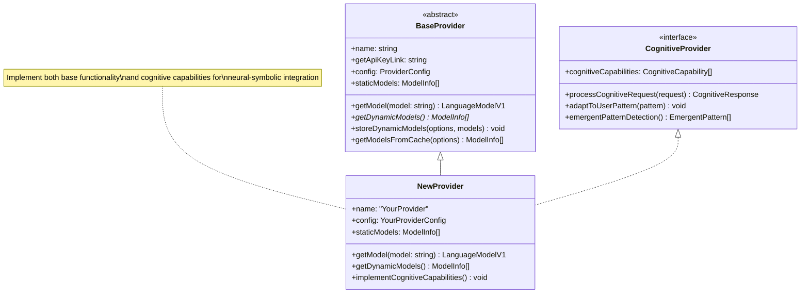
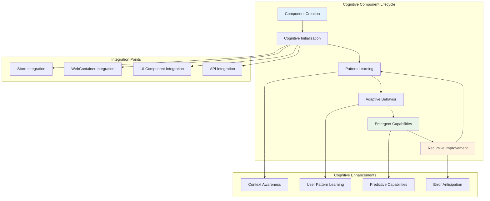
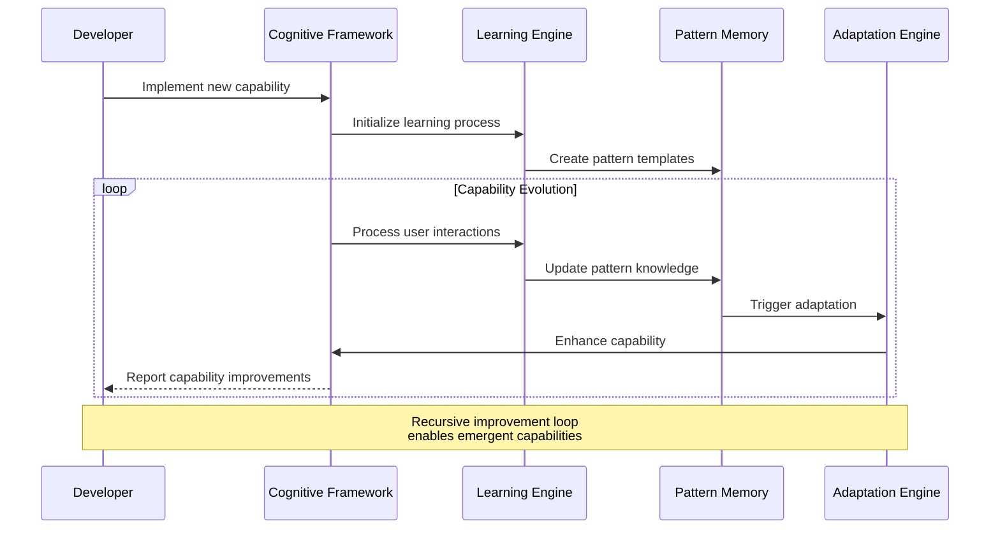
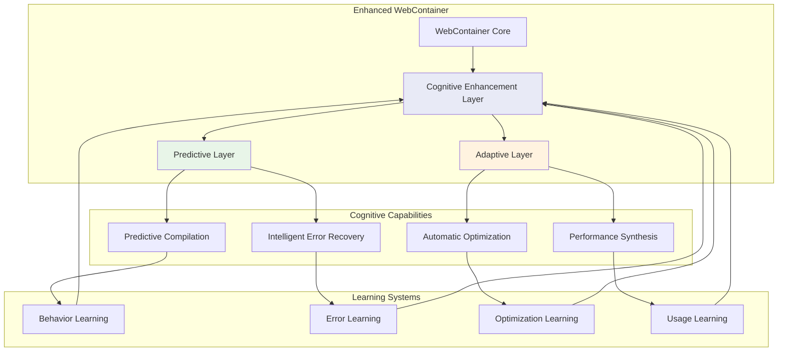
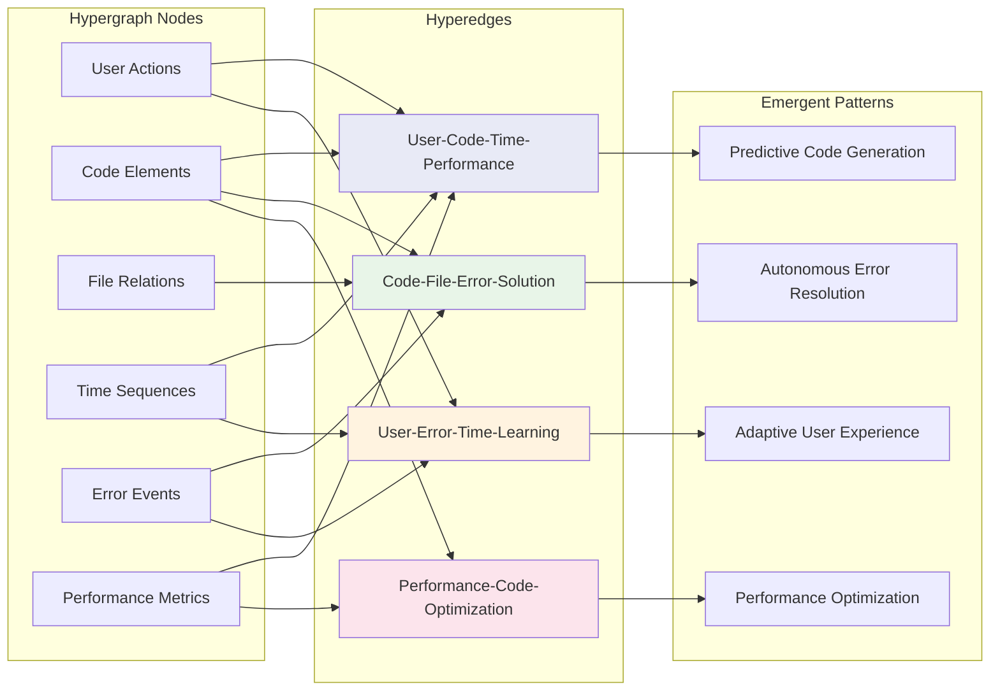
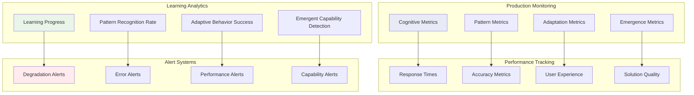

# Implementation Guide: Extending Bolt.diy Architecture

## Overview

This guide provides developers with comprehensive instructions for extending the bolt.diy architecture, implementing new cognitive patterns, and creating emergent AI capabilities. It demonstrates how to implement recursive pathways and hypergraph-centric development patterns.

## Core Extension Patterns

### LLM Provider Integration

Implementing new AI providers follows a cognitive pattern that enables neural-symbolic integration:



#### Step-by-Step Provider Implementation

1. **Create Provider Class**

```typescript
// app/lib/modules/llm/providers/your-provider.ts
import { BaseProvider } from '~/lib/modules/llm/base-provider';
import type { ModelInfo } from '~/lib/modules/llm/types';
import type { IProviderSetting } from '~/types/model';
import type { LanguageModelV1 } from 'ai';

export default class YourProvider extends BaseProvider {
  name = 'YourProvider';
  getApiKeyLink = 'https://your-provider.com/api-keys';

  config = {
    apiTokenKey: 'YOUR_PROVIDER_API_KEY',
  };

  staticModels: ModelInfo[] = [
    {
      name: 'your-model-id',
      label: 'Your Model Name',
      provider: 'YourProvider',
      maxTokenAllowed: 8000,
    },
  ];

  getModel(model: string): LanguageModelV1 {
    return this.createModel(model);
  }

  async getDynamicModels(
    apiKeys?: Record<string, string>,
    settings?: IProviderSetting,
    serverEnv: Record<string, string> = {},
  ): Promise<ModelInfo[]> {
    try {
      const apiKey = this.getApiKey(apiKeys, serverEnv);
      const models = await this.fetchModelsFromAPI(apiKey);
      return this.transformToModelInfo(models);
    } catch (error) {
      console.error('Failed to fetch dynamic models:', error);
      return [];
    }
  }

  private createModel(model: string): LanguageModelV1 {
    // Implement your model creation logic
    // using your provider's SDK
  }

  private async fetchModelsFromAPI(apiKey: string): Promise<any[]> {
    // Implement API call to fetch available models
  }

  private transformToModelInfo(models: any[]): ModelInfo[] {
    // Transform API response to ModelInfo format
  }
}
```

2. **Register Provider**

```typescript
// app/lib/modules/llm/registry.ts
export { default as YourProvider } from './providers/your-provider';
```

3. **Add Provider Configuration**

```typescript
// app/types/model.ts
export interface IProviderSetting {
  // ... existing providers
  YourProvider: {
    enabled: boolean;
    baseUrl?: string;
    // Add provider-specific settings
  };
}
```

### Cognitive Component Architecture

Implementing new cognitive components requires understanding the emergent pattern framework:



#### Cognitive Store Implementation

```typescript
// app/lib/stores/cognitive-store.ts
import { atom, map, type MapStore, type WritableAtom } from 'nanostores';
import { createScopedLogger } from '~/utils/logger';

const logger = createScopedLogger('CognitiveStore');

export interface CognitivePattern {
  id: string;
  type: 'user_behavior' | 'code_pattern' | 'error_pattern' | 'workflow_pattern';
  confidence: number;
  frequency: number;
  lastSeen: Date;
  metadata: Record<string, any>;
}

export interface CognitiveInsight {
  id: string;
  pattern: CognitivePattern;
  prediction: string;
  confidence: number;
  recommendedActions: string[];
}

export class CognitiveStore {
  // Cognitive state management
  patterns: MapStore<Record<string, CognitivePattern>> = map({});
  insights: WritableAtom<CognitiveInsight[]> = atom([]);
  learningProgress: WritableAtom<number> = atom(0);
  
  // Cognitive capabilities
  contextAwareness: WritableAtom<boolean> = atom(false);
  predictiveCapabilities: WritableAtom<boolean> = atom(false);
  adaptiveBehavior: WritableAtom<boolean> = atom(false);

  constructor() {
    this.initializeCognitiveCapabilities();
    this.loadPersistedPatterns();
  }

  // Pattern learning and recognition
  learnPattern(pattern: Partial<CognitivePattern>): void {
    const fullPattern: CognitivePattern = {
      id: this.generatePatternId(),
      confidence: 0.5,
      frequency: 1,
      lastSeen: new Date(),
      ...pattern,
    } as CognitivePattern;

    const existingPattern = this.findSimilarPattern(fullPattern);
    
    if (existingPattern) {
      this.reinforcePattern(existingPattern.id, fullPattern);
    } else {
      this.patterns.setKey(fullPattern.id, fullPattern);
    }
    
    this.updateLearningProgress();
    logger.info('Pattern learned:', fullPattern.type);
  }

  // Predictive insight generation
  generateInsights(context: any): CognitiveInsight[] {
    const relevantPatterns = this.getRelevantPatterns(context);
    const insights = relevantPatterns
      .map(pattern => this.generateInsightFromPattern(pattern, context))
      .filter(insight => insight.confidence > 0.6);
    
    this.insights.set(insights);
    return insights;
  }

  // Adaptive behavior implementation
  adaptToUserBehavior(userAction: any): void {
    this.learnPattern({
      type: 'user_behavior',
      metadata: {
        action: userAction.type,
        context: userAction.context,
        timestamp: Date.now(),
      },
    });

    this.updateAdaptiveBehavior();
  }

  // Recursive self-improvement
  improveCognitiveCapabilities(): void {
    const patterns = Object.values(this.patterns.get());
    const improvementOpportunities = this.analyzePatterns(patterns);
    
    improvementOpportunities.forEach(opportunity => {
      this.implementImprovement(opportunity);
    });
  }

  private initializeCognitiveCapabilities(): void {
    // Enable cognitive capabilities based on learned patterns
    this.patterns.subscribe(patterns => {
      const patternCount = Object.keys(patterns).length;
      
      if (patternCount > 10) {
        this.contextAwareness.set(true);
      }
      
      if (patternCount > 50) {
        this.predictiveCapabilities.set(true);
      }
      
      if (patternCount > 100) {
        this.adaptiveBehavior.set(true);
      }
    });
  }

  private findSimilarPattern(pattern: CognitivePattern): CognitivePattern | null {
    const patterns = Object.values(this.patterns.get());
    return patterns.find(p => 
      p.type === pattern.type && 
      this.calculateSimilarity(p.metadata, pattern.metadata) > 0.8
    ) || null;
  }

  private reinforcePattern(patternId: string, newPattern: CognitivePattern): void {
    const existing = this.patterns.get()[patternId];
    if (existing) {
      this.patterns.setKey(patternId, {
        ...existing,
        confidence: Math.min(existing.confidence + 0.1, 1.0),
        frequency: existing.frequency + 1,
        lastSeen: new Date(),
      });
    }
  }

  private calculateSimilarity(metadata1: any, metadata2: any): number {
    // Implement similarity calculation algorithm
    // This is a simplified version
    const keys1 = Object.keys(metadata1);
    const keys2 = Object.keys(metadata2);
    const commonKeys = keys1.filter(k => keys2.includes(k));
    
    if (commonKeys.length === 0) return 0;
    
    const similarityScore = commonKeys.reduce((acc, key) => {
      if (metadata1[key] === metadata2[key]) {
        return acc + 1;
      }
      return acc;
    }, 0);
    
    return similarityScore / Math.max(keys1.length, keys2.length);
  }
}

export const cognitiveStore = new CognitiveStore();
```

### Emergent AI Capability Development

Creating emergent AI capabilities requires implementing recursive learning patterns:



#### Emergent Capability Framework

```typescript
// app/lib/cognitive/emergent-capabilities.ts
export interface EmergentCapability {
  id: string;
  name: string;
  description: string;
  maturityLevel: 'nascent' | 'developing' | 'mature' | 'transcendent';
  prerequisites: string[];
  manifestations: CapabilityManifestation[];
}

export interface CapabilityManifestation {
  trigger: string;
  response: string;
  confidence: number;
  effectiveness: number;
}

export class EmergentCapabilityEngine {
  private capabilities: Map<string, EmergentCapability> = new Map();
  private interactionHistory: InteractionRecord[] = [];
  private learningThresholds = {
    nascent: 10,
    developing: 50,
    mature: 200,
    transcendent: 1000,
  };

  // Register potential emergent capability
  registerCapability(capability: Partial<EmergentCapability>): void {
    const fullCapability: EmergentCapability = {
      maturityLevel: 'nascent',
      manifestations: [],
      ...capability,
    } as EmergentCapability;

    this.capabilities.set(fullCapability.id, fullCapability);
    this.monitorCapabilityEmergence(fullCapability.id);
  }

  // Process interaction and detect emergence
  processInteraction(interaction: InteractionRecord): void {
    this.interactionHistory.push(interaction);
    
    // Analyze patterns for capability emergence
    this.analyzeEmergencePatterns(interaction);
    
    // Update existing capabilities
    this.updateCapabilityManifestations(interaction);
    
    // Check for capability evolution
    this.checkCapabilityEvolution();
  }

  private analyzeEmergencePatterns(interaction: InteractionRecord): void {
    const patterns = this.extractPatterns(interaction);
    
    patterns.forEach(pattern => {
      const potentialCapability = this.identifyPotentialCapability(pattern);
      if (potentialCapability && !this.capabilities.has(potentialCapability.id)) {
        this.registerCapability(potentialCapability);
      }
    });
  }

  private updateCapabilityManifestations(interaction: InteractionRecord): void {
    this.capabilities.forEach((capability, id) => {
      if (this.isRelevantToCapability(interaction, capability)) {
        const manifestation = this.createManifestation(interaction, capability);
        capability.manifestations.push(manifestation);
        
        this.capabilities.set(id, capability);
      }
    });
  }

  private checkCapabilityEvolution(): void {
    this.capabilities.forEach((capability, id) => {
      const interactionCount = capability.manifestations.length;
      const newMaturityLevel = this.calculateMaturityLevel(interactionCount);
      
      if (newMaturityLevel !== capability.maturityLevel) {
        this.evolveCapability(id, newMaturityLevel);
      }
    });
  }

  private evolveCapability(
    capabilityId: string, 
    newMaturityLevel: EmergentCapability['maturityLevel']
  ): void {
    const capability = this.capabilities.get(capabilityId)!;
    capability.maturityLevel = newMaturityLevel;
    
    // Unlock new manifestation patterns at higher maturity levels
    this.unlockAdvancedManifestations(capability);
    
    this.capabilities.set(capabilityId, capability);
    
    console.log(`Capability ${capability.name} evolved to ${newMaturityLevel}`);
  }

  // Transcendent capability detection
  detectTranscendentCapabilities(): EmergentCapability[] {
    return Array.from(this.capabilities.values())
      .filter(cap => cap.maturityLevel === 'transcendent')
      .filter(cap => this.hasNovelProblemSolvingAbility(cap));
  }

  private hasNovelProblemSolvingAbility(capability: EmergentCapability): boolean {
    // Analyze manifestations for novel problem-solving patterns
    const noveltyScore = capability.manifestations.reduce((score, manifestation) => {
      return score + this.calculateNoveltyScore(manifestation);
    }, 0) / capability.manifestations.length;
    
    return noveltyScore > 0.8;
  }
}
```

## Advanced Integration Patterns

### WebContainer Cognitive Enhancement



#### Cognitive WebContainer Implementation

```typescript
// app/lib/webcontainer/cognitive-webcontainer.ts
import { WebContainer } from '@webcontainer/api';
import { cognitiveStore } from '~/lib/stores/cognitive-store';

export class CognitiveWebContainer {
  private webcontainer: WebContainer;
  private behaviorPredictor: BehaviorPredictor;
  private errorRecoverySystem: ErrorRecoverySystem;
  private performanceOptimizer: PerformanceOptimizer;

  constructor(webcontainer: WebContainer) {
    this.webcontainer = webcontainer;
    this.initializeCognitiveEnhancements();
  }

  // Predictive file operations
  async writeFileWithPrediction(
    path: string, 
    content: string,
    context?: any
  ): Promise<void> {
    // Predict potential issues before writing
    const predictions = await this.behaviorPredictor.predictFileWriteIssues(
      path, 
      content, 
      context
    );

    // Apply preemptive optimizations
    const optimizedContent = await this.performanceOptimizer.optimizeContent(
      content,
      predictions
    );

    try {
      await this.webcontainer.fs.writeFile(path, optimizedContent);
      
      // Learn from successful operation
      cognitiveStore.learnPattern({
        type: 'code_pattern',
        metadata: {
          operation: 'file_write',
          path,
          success: true,
          predictions,
        },
      });
    } catch (error) {
      // Cognitive error recovery
      await this.errorRecoverySystem.recoverFromFileWriteError(
        path,
        content,
        error,
        predictions
      );
    }
  }

  // Intelligent command execution
  async executeCommandWithCognition(
    command: string,
    context?: any
  ): Promise<any> {
    // Predict command outcomes
    const predictions = await this.behaviorPredictor.predictCommandOutcome(
      command,
      context
    );

    // Pre-emptive error prevention
    if (predictions.errorProbability > 0.7) {
      const preventiveActions = await this.errorRecoverySystem
        .generatePreventiveActions(command, predictions);
      
      for (const action of preventiveActions) {
        await this.executePreventiveAction(action);
      }
    }

    try {
      const result = await this.webcontainer.spawn(command.split(' ')[0], 
        command.split(' ').slice(1));
      
      // Learn from command execution
      this.learnFromCommandExecution(command, result, predictions);
      
      return result;
    } catch (error) {
      return await this.errorRecoverySystem.recoverFromCommandError(
        command,
        error,
        predictions
      );
    }
  }

  private initializeCognitiveEnhancements(): void {
    this.behaviorPredictor = new BehaviorPredictor();
    this.errorRecoverySystem = new ErrorRecoverySystem(this.webcontainer);
    this.performanceOptimizer = new PerformanceOptimizer();
  }
}

class BehaviorPredictor {
  async predictFileWriteIssues(
    path: string,
    content: string,
    context?: any
  ): Promise<FilePrediction> {
    // Analyze patterns from cognitive store
    const patterns = cognitiveStore.patterns.get();
    const relevantPatterns = Object.values(patterns)
      .filter(p => p.type === 'code_pattern')
      .filter(p => this.isRelevantToFile(p, path, content));

    // Generate predictions based on learned patterns
    return {
      errorProbability: this.calculateErrorProbability(relevantPatterns),
      performanceImpact: this.calculatePerformanceImpact(content),
      dependencyIssues: this.predictDependencyIssues(content, context),
    };
  }

  async predictCommandOutcome(
    command: string,
    context?: any
  ): Promise<CommandPrediction> {
    // Similar pattern-based prediction for commands
    const commandPatterns = this.getCommandPatterns(command);
    
    return {
      successProbability: this.calculateSuccessProbability(commandPatterns),
      errorProbability: this.calculateErrorProbability(commandPatterns),
      expectedDuration: this.predictExecutionDuration(command, context),
      resourceUsage: this.predictResourceUsage(command),
    };
  }
}
```

### Hypergraph Data Architecture

Implementing hypergraph relationships for complex cognitive patterns:



#### Hypergraph Implementation

```typescript
// app/lib/cognitive/hypergraph.ts
export interface HypergraphNode {
  id: string;
  type: 'user' | 'code' | 'file' | 'time' | 'error' | 'performance';
  data: any;
  timestamp: Date;
}

export interface HypergraphEdge {
  id: string;
  nodes: string[];
  relationship: string;
  weight: number;
  metadata: any;
}

export interface EmergentHyperpattern {
  id: string;
  edges: string[];
  pattern: string;
  confidence: number;
  manifestations: any[];
}

export class CognitiveHypergraph {
  private nodes: Map<string, HypergraphNode> = new Map();
  private edges: Map<string, HypergraphEdge> = new Map();
  private patterns: Map<string, EmergentHyperpattern> = new Map();

  // Add cognitive entity to hypergraph
  addNode(node: HypergraphNode): void {
    this.nodes.set(node.id, node);
    this.analyzeNodeRelationships(node);
  }

  // Create multi-dimensional relationship
  addHyperedge(edge: HypergraphEdge): void {
    this.edges.set(edge.id, edge);
    this.detectEmergentPatterns(edge);
  }

  // Discover emergent patterns through hypergraph analysis
  discoverEmergentPatterns(): EmergentHyperpattern[] {
    const patternCandidates = this.analyzeHypergraphStructure();
    const validatedPatterns = this.validatePatterns(patternCandidates);
    
    validatedPatterns.forEach(pattern => {
      this.patterns.set(pattern.id, pattern);
    });
    
    return validatedPatterns;
  }

  // Query hypergraph for cognitive insights
  queryRelationships(
    nodeTypes: string[],
    relationshipTypes: string[]
  ): HypergraphEdge[] {
    return Array.from(this.edges.values())
      .filter(edge => {
        const edgeNodeTypes = edge.nodes.map(nodeId => 
          this.nodes.get(nodeId)?.type
        );
        
        return nodeTypes.some(type => edgeNodeTypes.includes(type)) &&
               relationshipTypes.includes(edge.relationship);
      });
  }

  // Generate cognitive predictions from hypergraph
  generatePredictions(context: any): CognitivePrediction[] {
    const relevantPatterns = this.getRelevantPatterns(context);
    
    return relevantPatterns.map(pattern => ({
      type: pattern.pattern,
      confidence: pattern.confidence,
      prediction: this.generatePredictionFromPattern(pattern, context),
      recommendations: this.generateRecommendations(pattern, context),
    }));
  }

  private analyzeNodeRelationships(node: HypergraphNode): void {
    // Find related nodes based on similarity and temporal proximity
    const relatedNodes = this.findRelatedNodes(node);
    
    // Create hyperedges for multi-dimensional relationships
    relatedNodes.forEach(group => {
      if (group.length >= 2) {
        const edge: HypergraphEdge = {
          id: this.generateEdgeId(),
          nodes: group.map(n => n.id),
          relationship: this.inferRelationshipType(group),
          weight: this.calculateRelationshipWeight(group),
          metadata: this.extractRelationshipMetadata(group),
        };
        
        this.addHyperedge(edge);
      }
    });
  }

  private detectEmergentPatterns(edge: HypergraphEdge): void {
    // Analyze edge in context of existing hypergraph structure
    const structuralContext = this.getStructuralContext(edge);
    const temporalContext = this.getTemporalContext(edge);
    
    // Detect potential emergent patterns
    const patternSignatures = this.extractPatternSignatures(
      edge,
      structuralContext,
      temporalContext
    );
    
    patternSignatures.forEach(signature => {
      const existingPattern = this.findSimilarPattern(signature);
      
      if (existingPattern) {
        this.reinforcePattern(existingPattern, edge);
      } else {
        this.createNewPattern(signature, edge);
      }
    });
  }
}
```

## Testing Cognitive Capabilities

### Cognitive Test Framework

```typescript
// app/tests/cognitive/cognitive-test-framework.ts
export interface CognitiveTestCase {
  id: string;
  description: string;
  cognitiveCapability: string;
  input: any;
  expectedOutcome: CognitiveExpectation;
  emergentBehaviorIndicators: string[];
}

export interface CognitiveExpectation {
  patternRecognition: boolean;
  adaptiveBehavior: boolean;
  predictiveAccuracy: number;
  learningEvidence: boolean;
}

export class CognitiveTestRunner {
  async runCognitiveTest(testCase: CognitiveTestCase): Promise<CognitiveTestResult> {
    const startState = this.captureSystemState();
    
    // Execute test scenario
    const result = await this.executeCognitiveScenario(testCase);
    
    const endState = this.captureSystemState();
    
    // Analyze cognitive changes
    const cognitiveAnalysis = this.analyzeCognitiveChanges(
      startState,
      endState,
      testCase
    );
    
    return {
      testCase,
      result,
      cognitiveAnalysis,
      emergentBehaviors: this.detectEmergentBehaviors(result, testCase),
      passed: this.evaluateTestSuccess(result, testCase.expectedOutcome),
    };
  }

  async runCognitiveSuite(testSuite: CognitiveTestCase[]): Promise<CognitiveTestReport> {
    const results = await Promise.all(
      testSuite.map(test => this.runCognitiveTest(test))
    );
    
    return {
      totalTests: testSuite.length,
      passed: results.filter(r => r.passed).length,
      failed: results.filter(r => !r.passed).length,
      emergentCapabilities: this.aggregateEmergentCapabilities(results),
      cognitiveGrowth: this.measureCognitiveGrowth(results),
      recommendations: this.generateImprovementRecommendations(results),
    };
  }
}

// Example cognitive test cases
export const cognitiveTestCases: CognitiveTestCase[] = [
  {
    id: 'pattern-recognition-test',
    description: 'Test system ability to recognize user coding patterns',
    cognitiveCapability: 'pattern_recognition',
    input: {
      userActions: [
        { type: 'create_component', pattern: 'functional_component' },
        { type: 'add_styling', pattern: 'css_modules' },
        { type: 'add_tests', pattern: 'jest_testing' },
      ],
    },
    expectedOutcome: {
      patternRecognition: true,
      adaptiveBehavior: false,
      predictiveAccuracy: 0.7,
      learningEvidence: true,
    },
    emergentBehaviorIndicators: [
      'suggests_similar_patterns',
      'predicts_next_action',
      'adapts_code_generation',
    ],
  },
  
  {
    id: 'adaptive-behavior-test',
    description: 'Test system adaptation to user preferences',
    cognitiveCapability: 'adaptive_behavior',
    input: {
      userFeedback: [
        { action: 'modify_code_style', preference: 'functional_programming' },
        { action: 'reject_suggestion', reason: 'too_complex' },
        { action: 'approve_suggestion', reason: 'clean_simple' },
      ],
    },
    expectedOutcome: {
      patternRecognition: true,
      adaptiveBehavior: true,
      predictiveAccuracy: 0.8,
      learningEvidence: true,
    },
    emergentBehaviorIndicators: [
      'adjusts_code_style',
      'simplifies_suggestions',
      'remembers_preferences',
    ],
  },
];
```

## Deployment Considerations

### Cognitive Capability Monitoring



This implementation guide provides a comprehensive framework for extending bolt.diy with cognitive capabilities. The recursive patterns and hypergraph architectures enable the development of truly emergent AI systems that can adapt, learn, and evolve over time.