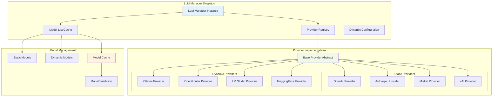
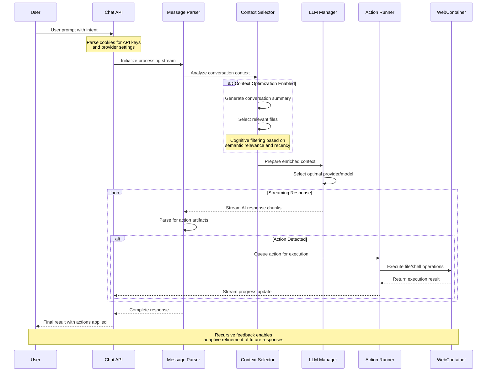
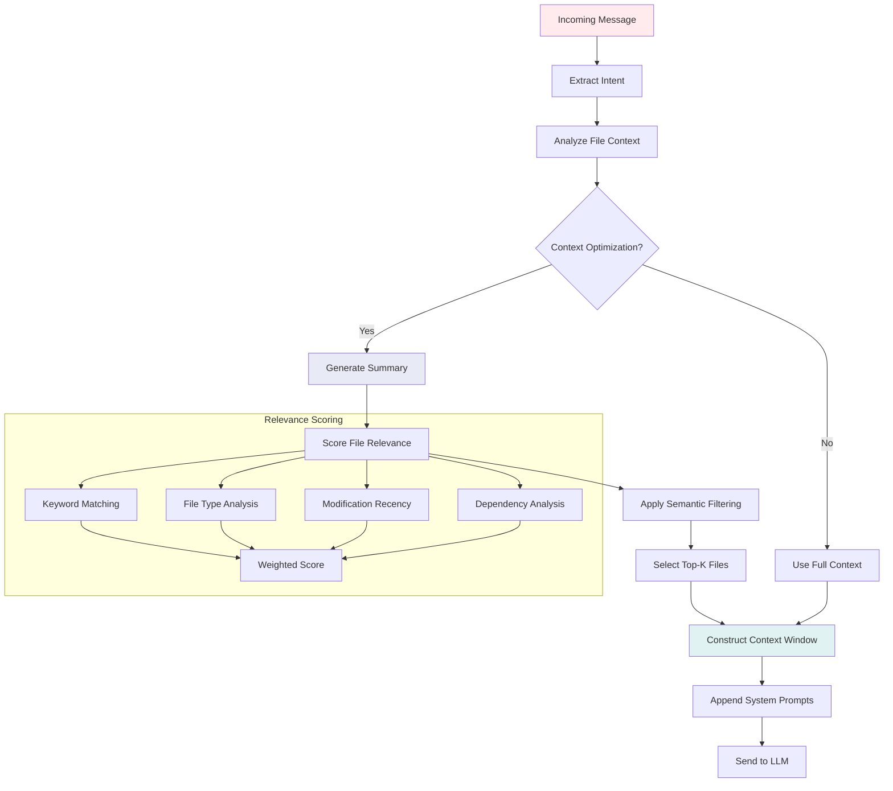
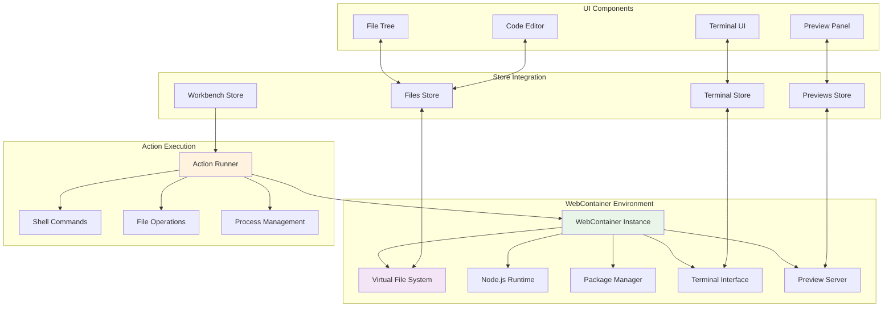
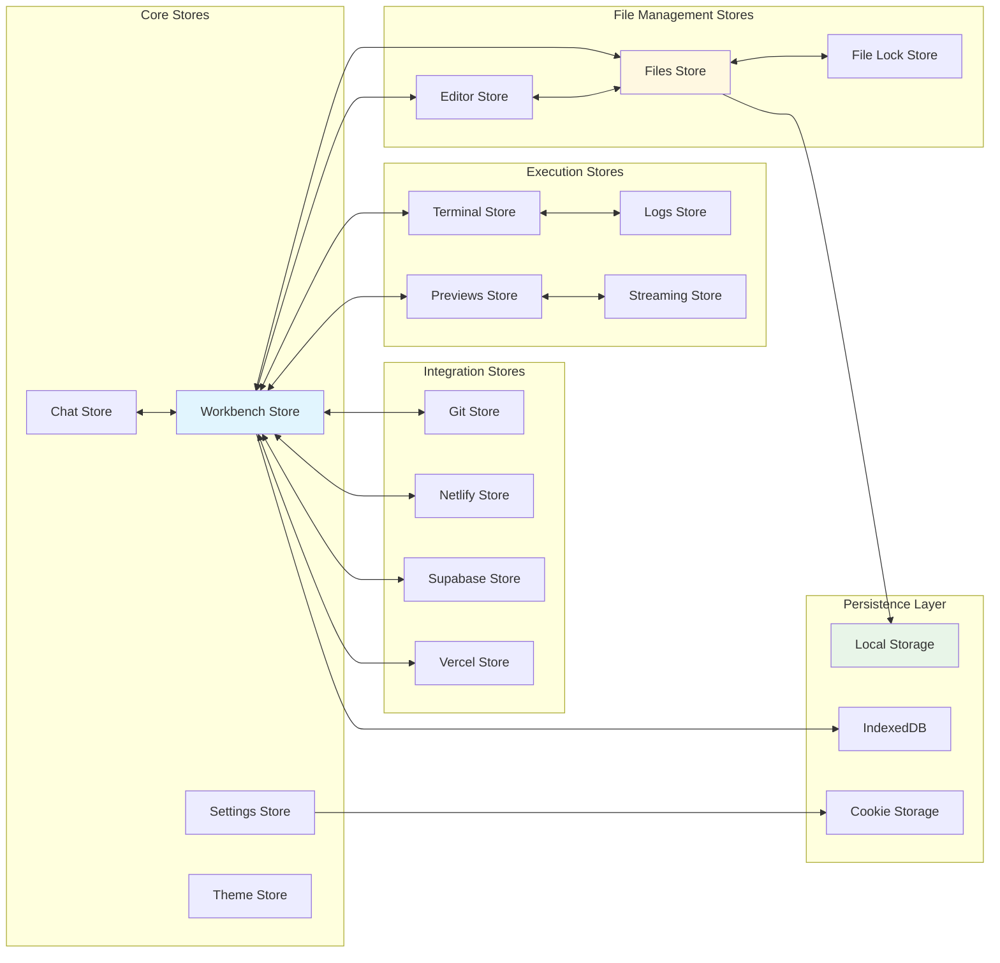
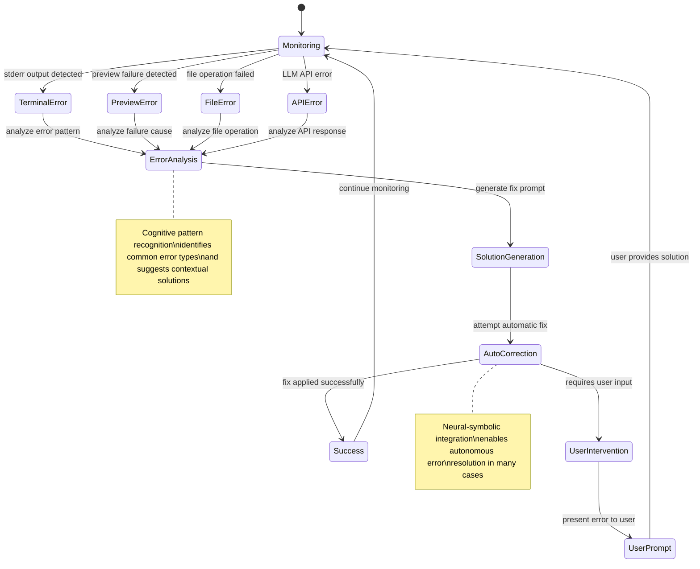
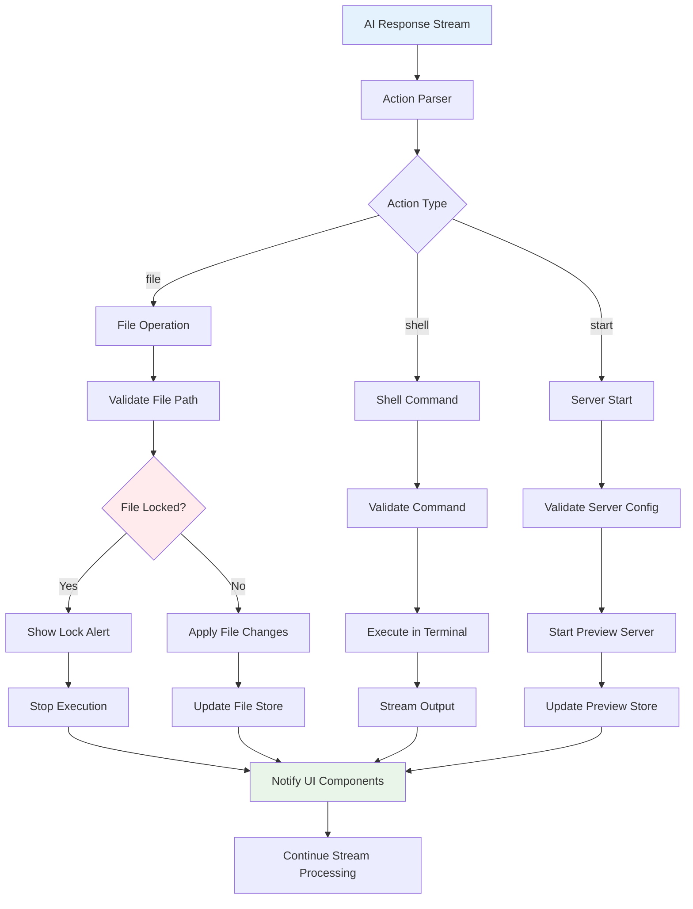
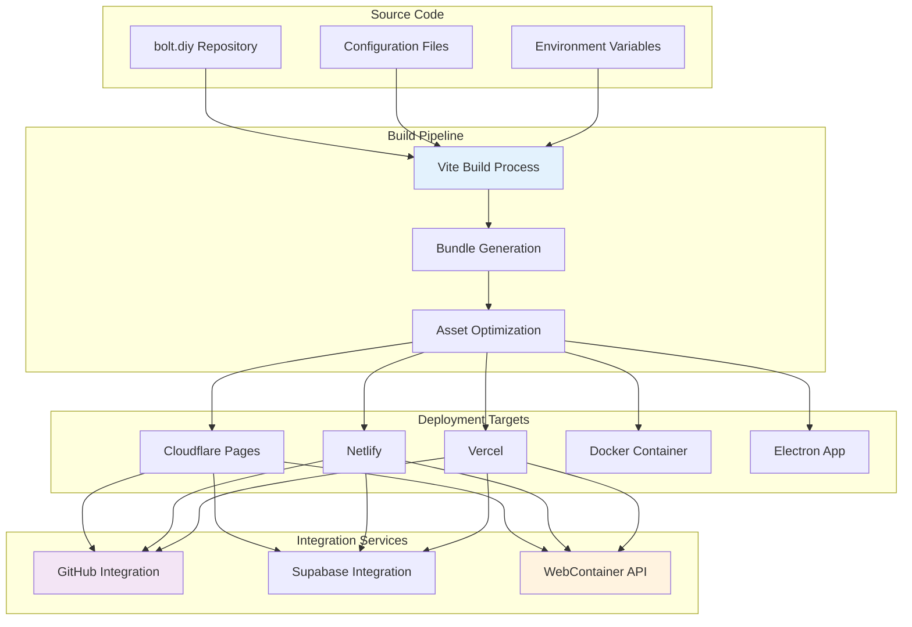
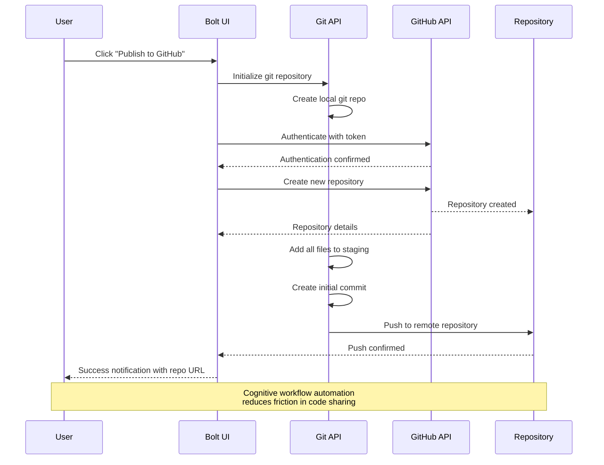
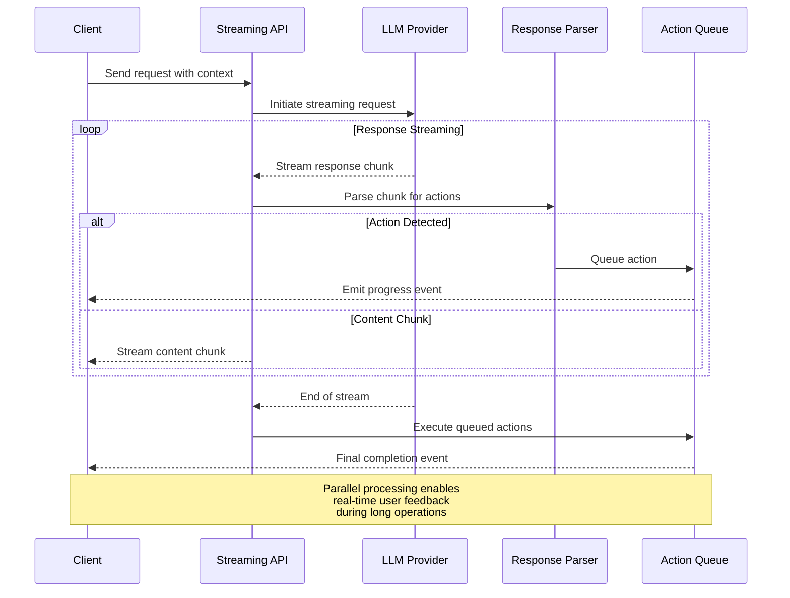

# Technical Implementation Architecture

## Core System Components

### LLM Integration Layer

The LLM Integration Layer provides a unified interface for multiple AI providers through a sophisticated provider registry pattern that enables hypergraph-like connections between different cognitive models.



#### Provider Registry Pattern

```typescript
// Simplified implementation showing cognitive pattern
class LLMManager {
  private static _instance: LLMManager;
  private _providers: Map<string, BaseProvider> = new Map();
  
  // Singleton ensures cognitive coherence
  static getInstance(env: Record<string, string> = {}): LLMManager {
    if (!LLMManager._instance) {
      LLMManager._instance = new LLMManager(env);
    }
    return LLMManager._instance;
  }
  
  // Hypergraph registration pattern
  registerProvider(provider: BaseProvider) {
    this._providers.set(provider.name, provider);
    this._modelList = [...this._modelList, ...provider.staticModels];
  }
  
  // Neural-symbolic model selection
  async updateModelList(options: ModelUpdateOptions): Promise<ModelInfo[]> {
    const dynamicModels = await Promise.all(
      this.getEnabledProviders(options)
        .filter(provider => provider.getDynamicModels)
        .map(provider => this.fetchDynamicModels(provider, options))
    );
    return this.mergeCognitiveModelSpace(dynamicModels);
  }
}
```

### Message Processing Pipeline

The message processing pipeline implements a cognitive flow that transforms user intent into executable actions through neural-symbolic integration.



### Context Selection Algorithm

The context selection mechanism implements adaptive attention allocation through semantic analysis and relevance scoring.



### WebContainer Integration Architecture

WebContainer provides an isolated browser-based Node.js environment that enables real-time code execution and preview generation.



### State Management Architecture

The application uses Nanostores for reactive state management, creating a cognitive state space that maintains consistency across all UI components.



## Cognitive Patterns Implementation

### Adaptive Attention Allocation

The system implements adaptive attention through dynamic context window management and relevance scoring algorithms.

```typescript
class ContextSelector {
  async selectContext(
    messages: Message[],
    files: FileMap,
    options: ContextOptions
  ): Promise<EnrichedContext> {
    // Cognitive analysis of conversation history
    const conversationSummary = await this.generateSummary(messages);
    
    // Semantic file relevance scoring
    const relevantFiles = await this.scoreFileRelevance(
      files,
      messages,
      conversationSummary
    );
    
    // Adaptive context window sizing
    const contextWindow = this.optimizeContextWindow(
      relevantFiles,
      options.maxTokens
    );
    
    return {
      summary: conversationSummary,
      files: contextWindow,
      metadata: this.extractMetadata(messages, files)
    };
  }
  
  private async scoreFileRelevance(
    files: FileMap,
    messages: Message[],
    summary: string
  ): Promise<ScoredFile[]> {
    return Object.entries(files).map(([path, content]) => ({
      path,
      content,
      score: this.calculateRelevanceScore(path, content, messages, summary)
    })).sort((a, b) => b.score - a.score);
  }
  
  private calculateRelevanceScore(
    path: string,
    content: string,
    messages: Message[],
    summary: string
  ): number {
    // Multi-dimensional scoring algorithm
    const keywordScore = this.calculateKeywordRelevance(content, messages);
    const recencyScore = this.calculateRecencyScore(path);
    const typeScore = this.calculateFileTypeRelevance(path, messages);
    const dependencyScore = this.calculateDependencyRelevance(path, content);
    
    return (
      keywordScore * 0.4 +
      recencyScore * 0.2 +
      typeScore * 0.3 +
      dependencyScore * 0.1
    );
  }
}
```

### Error Detection and Correction

The system implements cognitive error detection through multiple feedback channels.



### File Locking and Protection System

Implements recursive cognitive protection patterns to prevent unintended modifications.

```typescript
class FileLockSystem {
  private lockedFiles: Map<string, LockInfo> = new Map();
  private lockedFolders: Map<string, LockInfo> = new Map();
  
  // Cognitive lock checking with recursive pattern matching
  isLocked(filePath: string, chatId?: string): boolean {
    // Direct file lock check
    if (this.lockedFiles.has(filePath)) {
      return this.validateLockScope(this.lockedFiles.get(filePath)!, chatId);
    }
    
    // Recursive folder lock check (hypergraph traversal)
    for (const [folderPath, lockInfo] of this.lockedFolders.entries()) {
      if (filePath.startsWith(folderPath + '/')) {
        return this.validateLockScope(lockInfo, chatId);
      }
    }
    
    return false;
  }
  
  // Recursive folder locking (emergent protection pattern)
  lockFolder(folderPath: string, mode: LockMode, chatId?: string): void {
    const lockInfo: LockInfo = {
      mode,
      chatId,
      timestamp: Date.now(),
      recursive: true
    };
    
    this.lockedFolders.set(folderPath, lockInfo);
    this.persistLockState(chatId);
    
    // Emergent pattern: auto-lock child files
    this.propagateLockToChildren(folderPath, lockInfo);
  }
  
  private propagateLockToChildren(
    folderPath: string,
    lockInfo: LockInfo
  ): void {
    // Cognitive propagation of lock state through file tree
    const childPaths = this.getChildPaths(folderPath);
    childPaths.forEach(childPath => {
      if (!this.lockedFiles.has(childPath)) {
        this.lockedFiles.set(childPath, { ...lockInfo, inherited: true });
      }
    });
  }
}
```

## Action Execution Framework

### Action Runner Architecture

The Action Runner implements a cognitive execution engine that processes AI-generated actions through a queued, streaming interface.



### Streaming Action Execution

```typescript
class ActionRunner {
  private executionQueue: Promise<void> = Promise.resolve();
  
  async executeAction(
    action: BoltAction,
    context: ExecutionContext
  ): Promise<void> {
    // Queue execution to maintain cognitive coherence
    this.executionQueue = this.executionQueue.then(async () => {
      try {
        await this.processAction(action, context);
      } catch (error) {
        await this.handleExecutionError(error, action, context);
      }
    });
  }
  
  private async processAction(
    action: BoltAction,
    context: ExecutionContext
  ): Promise<void> {
    switch (action.type) {
      case 'file':
        return this.handleFileAction(action as FileAction, context);
      case 'shell':
        return this.handleShellAction(action as ShellAction, context);
      case 'start':
        return this.handleStartAction(action as StartAction, context);
      default:
        throw new Error(`Unknown action type: ${action.type}`);
    }
  }
  
  private async handleFileAction(
    action: FileAction,
    context: ExecutionContext
  ): Promise<void> {
    const filePath = action.filePath;
    
    // Cognitive lock validation
    if (this.isFileLocked(filePath, context.chatId)) {
      this.emitLockAlert(filePath, context);
      return;
    }
    
    // Apply file operation with WebContainer integration
    await this.webContainer.fs.writeFile(filePath, action.content);
    
    // Update cognitive state
    this.filesStore.updateFile(filePath, action.content);
    
    // Emit progress for real-time feedback
    this.emitProgress({
      type: 'file-update',
      path: filePath,
      status: 'completed'
    });
  }
}
```

## Deployment and Integration Patterns

### Multi-Platform Deployment Architecture



### GitHub Integration Workflow



## Performance Optimization Patterns

### Model Response Caching

The system implements intelligent caching patterns to optimize LLM response times and reduce API costs.

```typescript
class ModelResponseCache {
  private cache: Map<string, CachedResponse> = new Map();
  private ttl: number = 3600000; // 1 hour
  
  // Cognitive cache key generation
  private generateCacheKey(
    prompt: string,
    model: string,
    context: ContextHash
  ): string {
    const contextHash = this.hashContext(context);
    const promptHash = this.hashPrompt(prompt);
    return `${model}:${promptHash}:${contextHash}`;
  }
  
  // Semantic similarity checking
  async getCachedResponse(
    prompt: string,
    model: string,
    context: ContextHash
  ): Promise<CachedResponse | null> {
    const exactKey = this.generateCacheKey(prompt, model, context);
    
    if (this.cache.has(exactKey)) {
      const cached = this.cache.get(exactKey)!;
      if (Date.now() - cached.timestamp < this.ttl) {
        return cached;
      }
    }
    
    // Semantic similarity search for near-matches
    return this.findSimilarCachedResponse(prompt, model, context);
  }
  
  private async findSimilarCachedResponse(
    prompt: string,
    model: string,
    context: ContextHash
  ): Promise<CachedResponse | null> {
    // Implementation of semantic similarity matching
    // using embedding vectors or fuzzy string matching
    const candidates = Array.from(this.cache.entries())
      .filter(([key]) => key.startsWith(model))
      .map(([key, response]) => ({
        key,
        response,
        similarity: this.calculateSimilarity(prompt, response.originalPrompt)
      }))
      .filter(item => item.similarity > 0.85)
      .sort((a, b) => b.similarity - a.similarity);
    
    return candidates.length > 0 ? candidates[0].response : null;
  }
}
```

### Streaming Optimization



This technical architecture demonstrates the sophisticated cognitive patterns and neural-symbolic integration points that make bolt.diy a powerful platform for AI-assisted development. The recursive implementation pathways enable continuous learning and adaptation, creating an emergent system that becomes more effective over time.