# User Journey and Cognitive Workflows

## Overview

This documentation maps the cognitive user journeys through bolt.diy, illustrating how human-AI collaboration creates emergent development workflows. Each journey demonstrates neural-symbolic integration patterns and adaptive attention mechanisms.

## Core User Journeys

### Journey 1: Project Creation and Initial Development

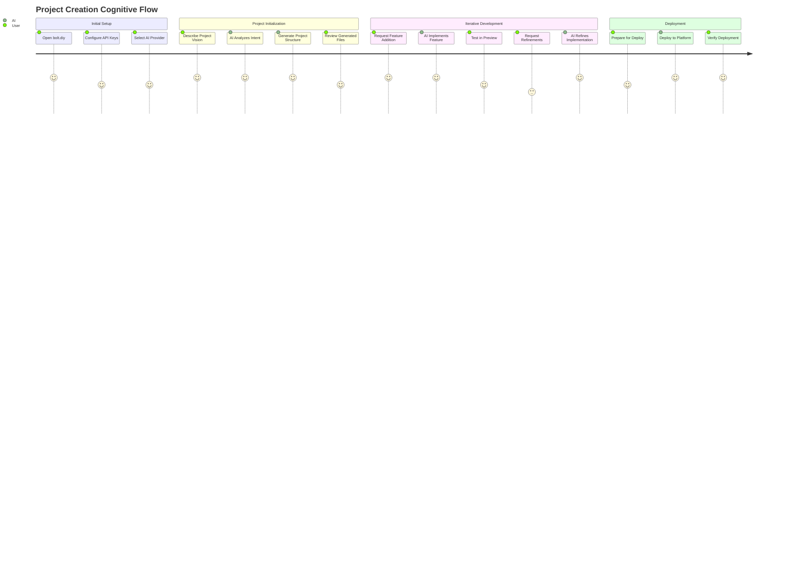

### Detailed Project Creation Sequence

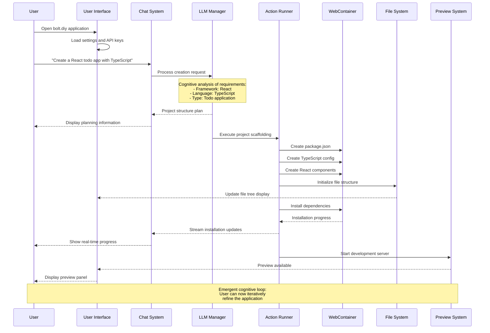

### Journey 2: Feature Development and Refinement

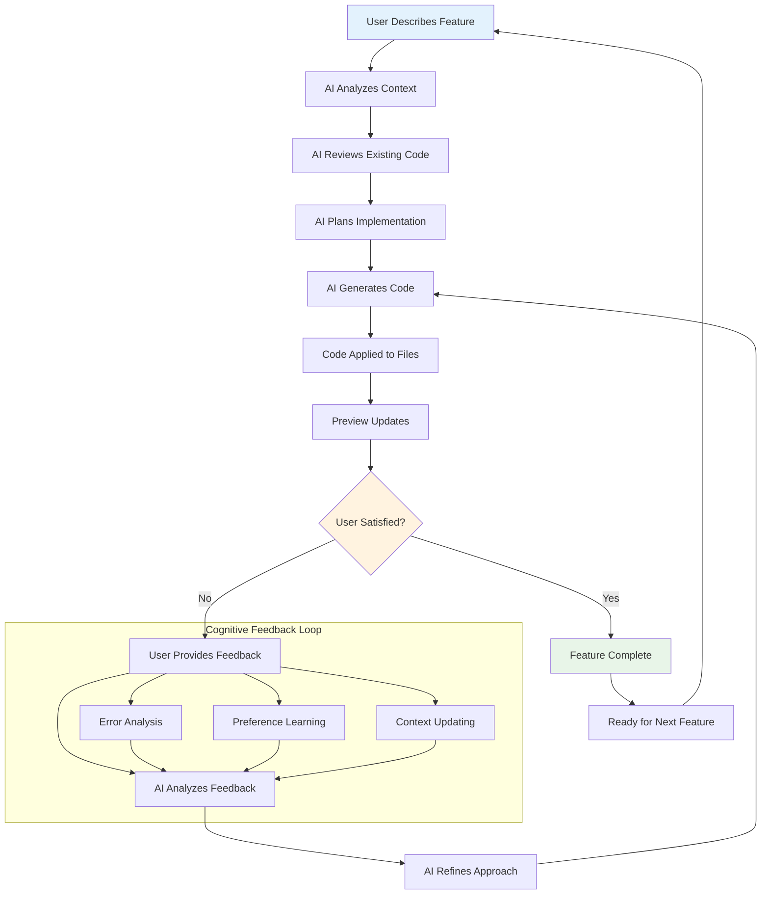

### Feature Implementation Sequence

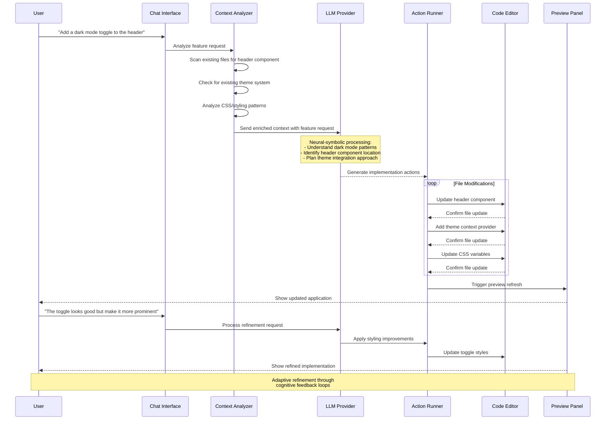

## Journey 3: Error Resolution and Debugging

### Error Detection and Resolution Flow

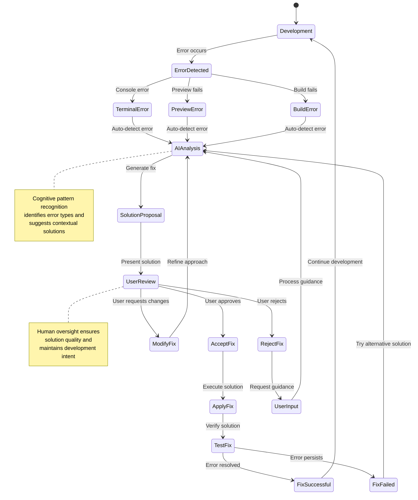

### Debugging Sequence Example

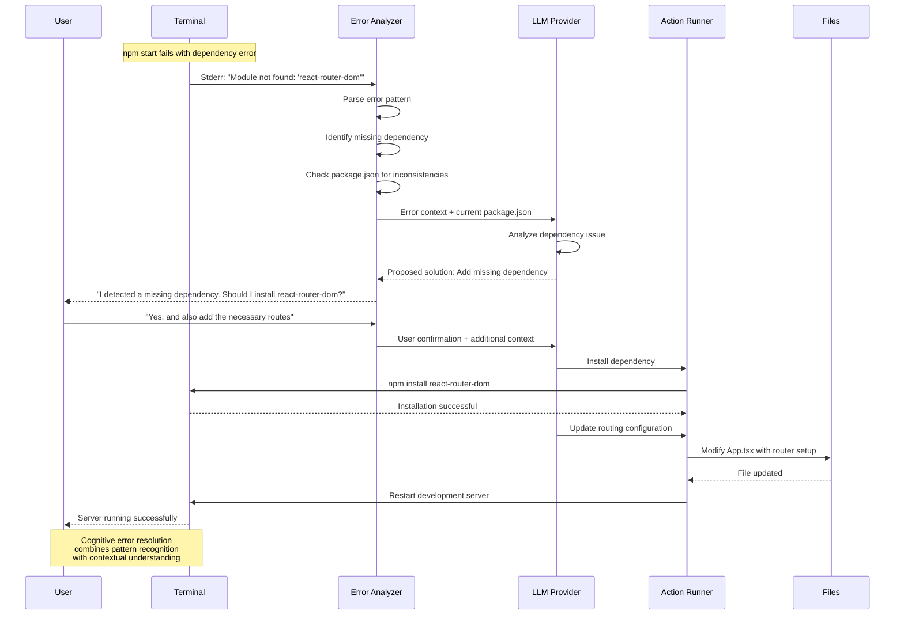

## Journey 4: Multi-File Project Management

### Complex Refactoring Workflow

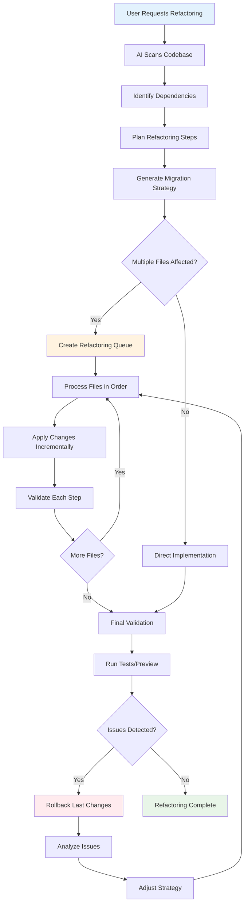

### File Dependency Analysis

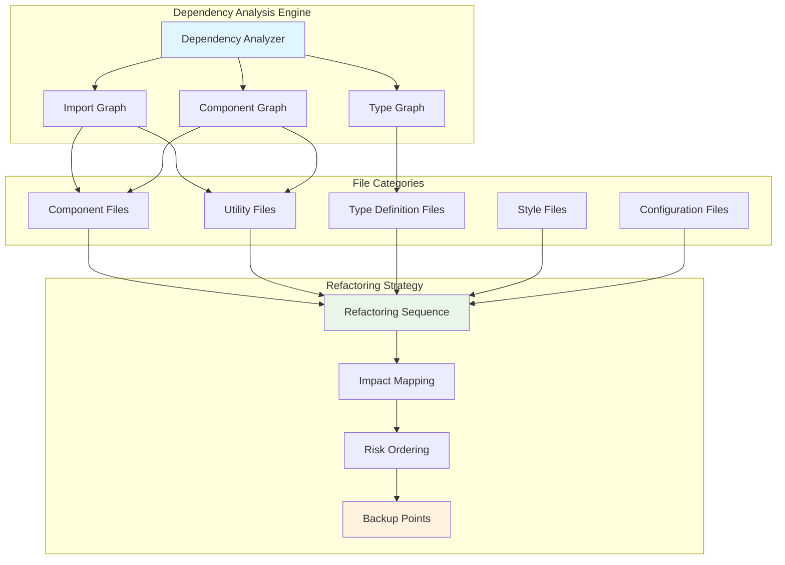

## Journey 5: Deployment and Sharing

### GitHub Integration Workflow

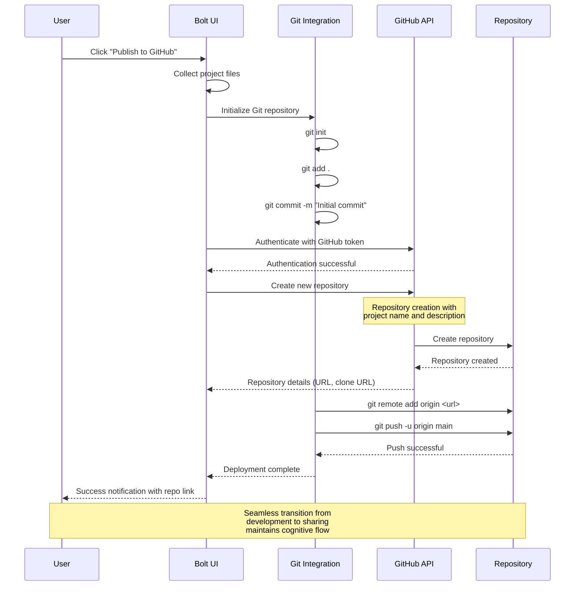

### Netlify Deployment Flow

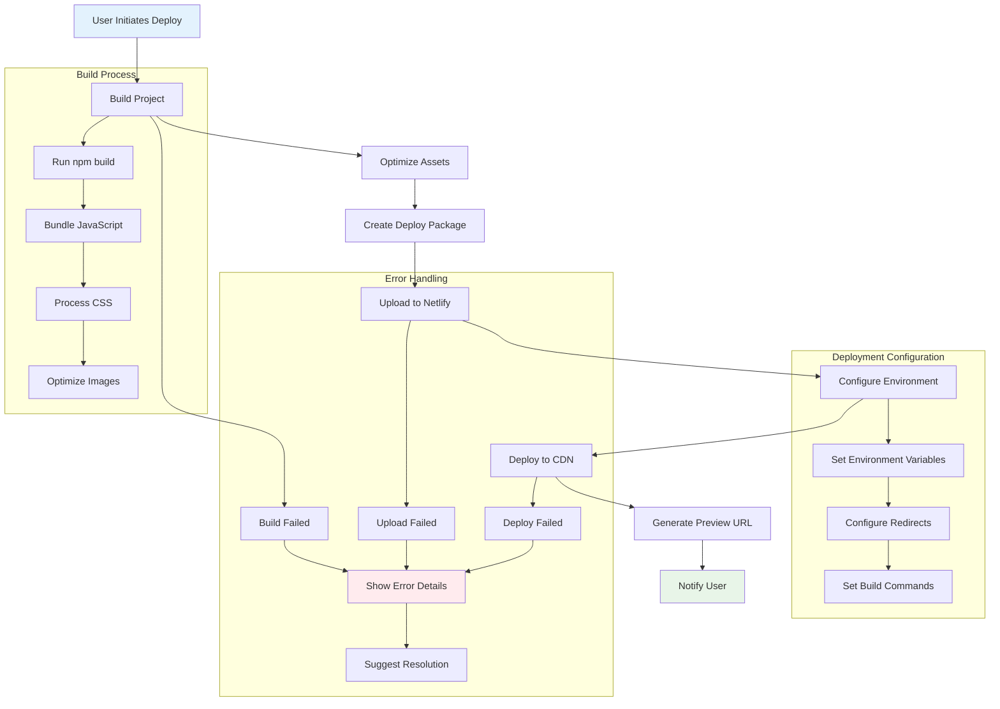

## Journey 6: Collaborative Development

### Real-time Collaboration Patterns

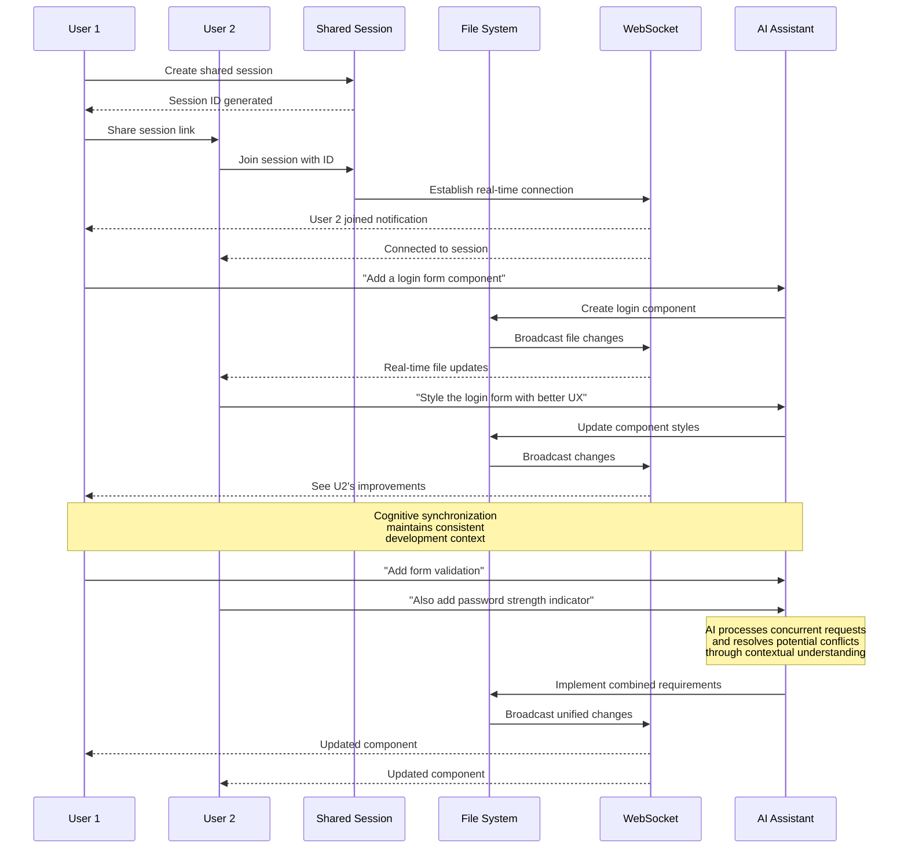

## Cognitive Learning Patterns

### Adaptive User Preference Learning

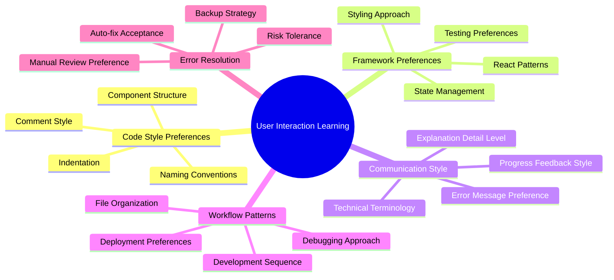

### Context Adaptation Sequence

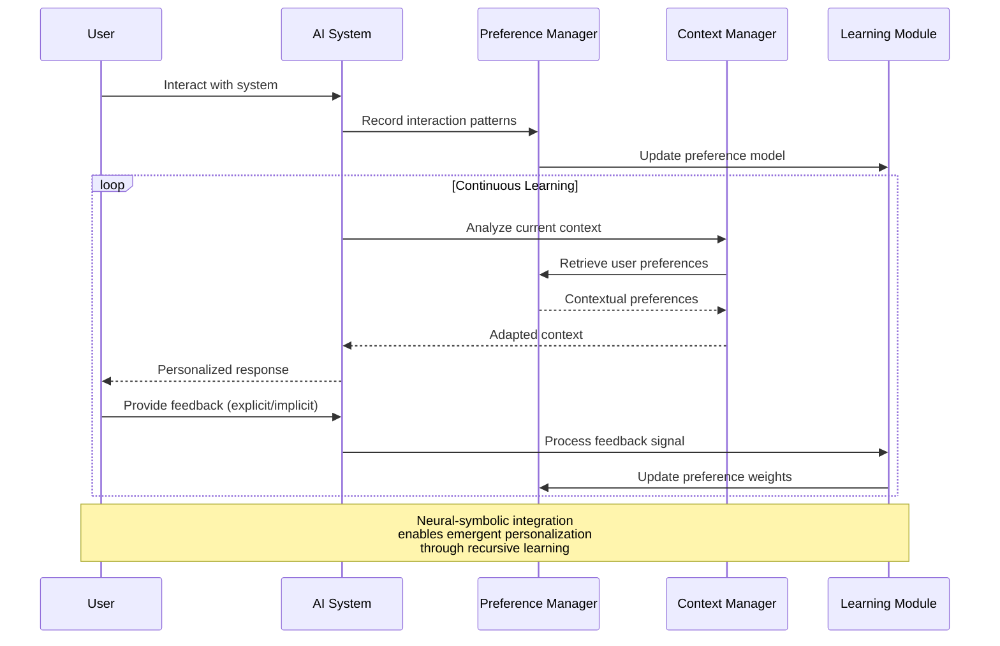

## Emergent Workflow Patterns

### Self-Organizing Development Cycles

The system exhibits emergent cognitive patterns where development workflows become increasingly optimized through repeated interactions:

1. **Pattern Recognition**: AI learns common development sequences
2. **Predictive Assistance**: System anticipates next likely actions
3. **Workflow Optimization**: Suggests more efficient development paths
4. **Error Prevention**: Proactively identifies potential issues
5. **Knowledge Synthesis**: Integrates learnings across sessions

### Hypergraph Relationship Mapping

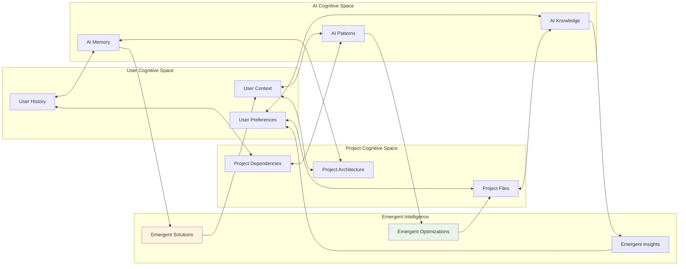

This user journey documentation captures the sophisticated cognitive workflows that emerge from human-AI collaboration in bolt.diy. Each journey demonstrates how neural-symbolic integration creates adaptive, learning systems that become more effective through recursive interaction patterns.